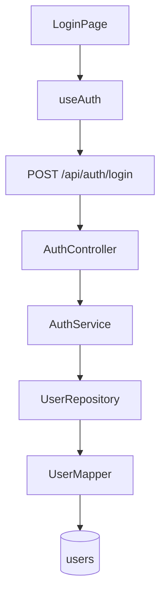

# 세계 최고 의존성 분석 도구 대비 VDA 갭 분석

> 작성일: 2026-04-10
> 목적: 개발자 PainPoint 해결 관점에서 VDA의 주요 기능 완성도와 부가기능 부족점을 검토

---

## 1. 벤치마크 대상

| 도구 | 강점 | VDA와 비교 |
|------|------|-----------|
| **dependency-cruiser** | 규칙 기반 의존성 검증, CI 통합, 위반 리포트 | VDA는 규칙 엔진 없음 |
| **NX Graph** | monorepo 프로젝트 간 의존성, 영향받는 프로젝트 | VDA는 MSA 서비스 간 분석 |
| **IntelliJ Dependency Matrix** | 모듈 간 양방향 의존성 매트릭스 | VDA는 그래프/트리만 |
| **Madge** | 순환 의존성 특화, 이미지 출력 | VDA는 순환 감지 + 시각화 |
| **Webpack Bundle Analyzer** | 번들 크기 트리맵, 중복 모듈 | VDA는 번들 분석 없음 |
| **Snyk/SonarQube** | 보안 취약점 + 코드 품질 | VDA는 보안/품질 분석 없음 |
| **ArchUnit** | 아키텍처 규칙 테스트 (Java) | VDA는 아키텍처 규칙 없음 |

---

## 2. 주요 기능 완성도 평가

### 2.1 분석 정확도 — 현재 85/100

| 기능 | 완성도 | 갭 |
|------|--------|---|
| Vue 컴포넌트 의존성 | 95% | Options API 미지원 |
| Pinia 스토어 추적 | 90% | $subscribe, $patch 미추적 |
| API 호출 → Endpoint 매칭 | 90% | 동적 URL, 환경변수 URL 미지원 |
| Spring DI 추적 | 90% | @Qualifier, 프로파일 미지원 |
| MyBatis → DB 체인 | 85% | 어노테이션 SQL, include refid 미지원 |
| Event 추적 | 80% | EventBus(mitt), Cloud Stream 미지원 |
| 프론트→백→DB E2E | 85% | DTO 타입 비교 이름만, 필드 타입 미비교 |

### 2.2 시각화/UX — 현재 80/100

| 기능 | 완성도 | 갭 |
|------|--------|---|
| Force-directed 그래프 | 90% | 엣지 번들링 없음, 대형 그래프 LOD 제한적 |
| 트리 뷰 | 85% | 가로 스크롤 이슈, 노드 수 많으면 느림 |
| 클러스터링 | 80% | 의미 기반 클러스터링 없음 (디렉토리 기반만) |
| 검색 | 85% | 정규식 검색 미지원, 고급 쿼리 없음 |
| 필터 | 90% | 프리셋 있으나 커스텀 저장 없음 |
| 내보내기 | 70% | PNG만, SVG/PDF/HTML 리포트 없음 |

### 2.3 개발자 PainPoint 해결력 — 현재 75/100

| PainPoint | 현재 해결 수준 | 부족한 점 |
|-----------|-------------|----------|
| "이 파일 수정하면 뭐가 깨지나?" | 80% — Impact 분석 API 있음 | UI에 전용 패널 없음, 변경 diff 연동 없음 |
| "이 API 쓰는 프론트 컴포넌트가 뭐지?" | 90% — API 매칭 + 역추적 | 잘 동작 |
| "순환 의존성 어디에 있나?" | 85% — 감지 + 오버레이 | 수정 가이드 없음, 해결 방법 제안 없음 |
| "미사용 코드가 뭐지?" | 75% — 고아 노드 감지 | 정확도 한계 (동적 import, lazy load 파악 어려움) |
| "DB 테이블 변경 영향도?" | 80% — 역추적 가능 | Bottom-up 전용 뷰 없음 |
| "새 팀원이 구조를 파악하려면?" | 70% — 그래프 시각화 | 가이드 모드, 설명 레이어 없음 |
| "코드 리뷰 시 변경 범위 확인" | 30% — Git 연동 없음 | **큰 갭**: diff 기반 영향 분석 없음 |
| "아키텍처 규칙 위반 자동 감지" | 0% | **큰 갭**: 규칙 엔진 없음 |

---

## 3. 세계 최고 수준으로 가기 위한 필수 개선 항목

### Tier S: 핵심 차별화 (개발자가 매일 쓰게 만드는 기능)

#### S-1. 아키텍처 규칙 엔진 (dependency-cruiser 수준)

**현재**: 순환 의존성만 감지, 규칙 없음
**목표**: 사용자가 정의한 규칙에 따라 의존성 위반을 자동 감지

```json
// .vdarc.json rules 예시
{
  "rules": [
    {
      "name": "no-circular",
      "severity": "error",
      "from": { "kind": "vue-component" },
      "to": { "kind": "vue-component" },
      "deny": "circular"
    },
    {
      "name": "components-no-direct-api",
      "severity": "warn",
      "from": { "path": "components/" },
      "to": { "kind": "api-call-site" },
      "deny": "direct",
      "message": "Components should use composables for API calls"
    },
    {
      "name": "service-layer-isolation",
      "severity": "error",
      "from": { "kind": "spring-controller" },
      "to": { "kind": "mybatis-mapper" },
      "deny": "direct",
      "message": "Controllers must not access mappers directly"
    }
  ]
}
```

**가치**: CI/CD에 통합하여 아키텍처 퇴행 자동 차단

---

#### S-2. Git Diff 기반 변경 영향 분석

**현재**: 전체 프로젝트 정적 분석만
**목표**: 특정 Git commit/PR의 변경 파일 기준 영향 범위 자동 계산

```bash
vda impact --diff HEAD~1..HEAD
# 또는
vda impact --branch feature/user-refactor
```

출력:
```
Changed files: 3
  - src/stores/user.ts (modified)
  - src/components/user/UserProfile.vue (modified)
  - src/api/users.ts (modified)

Impact analysis:
  Direct dependents: 12 files
  Transitive dependents: 28 files
  Affected API endpoints: GET /api/users, PUT /api/users/{id}
  Affected DB tables: users, user_roles
  Risk level: MEDIUM (touches auth layer)
```

**가치**: 코드 리뷰어가 PR의 실제 영향 범위를 즉시 파악

---

#### S-3. 의존성 매트릭스 뷰 (IntelliJ 수준)

**현재**: 그래프와 트리만
**목표**: 모듈/레이어 간 의존성을 매트릭스(히트맵)로 표시

```
             components/  stores/  composables/  api/  controllers/  services/  mappers/
components/     -          12        8           5      0             0          0
stores/         0           -        3           4      0             0          0
composables/    0           5        -           7      0             0          0
api/            0           0        0           -      0             0          0
controllers/    0           0        0           0      -             7          0
services/       0           0        0           0      0             -          5
mappers/        0           0        0           0      0             0          -
```

**가치**: 아키텍처 레이어 분리도를 한눈에 파악, 잘못된 의존 방향 즉시 발견

---

#### S-4. 실시간 IDE 통합 (VSCode Extension)

**현재**: 웹 UI만
**목표**: VSCode에서 파일 열 때 자동으로 의존성 정보 표시

- 파일 열면 사이드바에 의존성 트리 자동 표시
- 코드 위에 인라인 힌트: "이 API는 3개 컴포넌트에서 호출됨"
- 함수/컴포넌트 위에 CodeLens: "12 dependents | 5 dependencies"
- 우클릭 → "Show Dependency Graph" → 웹 UI로 이동

**가치**: 개발자가 IDE를 떠나지 않고 의존성 정보 활용

---

### Tier A: 분석 깊이 강화

#### A-1. Bottom-Up 영향도 뷰 (DB 테이블 기준)

**현재**: Top-down (컴포넌트 → DB) 분석만
**목표**: DB 테이블 선택 → 영향받는 모든 계층 역추적

```
users (DB Table)
  ← UserMapper.findAll (reads)
    ← UserMapper [MyBatis XML]
      ← UserMapper [interface]
        ← UserRepository
          ← UserService
            ← UserController (GET /api/users)
              ← axios.get('/api/users') [UserList.vue]
              ← axios.get('/api/users') [useAuth.ts]
```

**가치**: DBA가 테이블 스키마 변경 시 프론트엔드까지 영향 파악

---

#### A-2. 타입 수준 DTO 비교

**현재**: 필드 이름만 비교
**목표**: Java 타입 ↔ TypeScript 타입 호환성 검사

```
Backend: Long id        → Frontend: number id      ✅ 호환
Backend: String email   → Frontend: string email   ✅ 호환
Backend: BigDecimal amt → Frontend: number amount   ⚠️ 이름 다름
Backend: LocalDateTime  → Frontend: string          ⚠️ 타입 불일치 가능
```

---

#### A-3. 번들 크기 영향 분석

**현재**: 없음
**목표**: 특정 컴포넌트/라이브러리 제거 시 번들 크기 변화 예측

---

#### A-4. JPA/Hibernate 지원

**현재**: MyBatis XML만
**목표**: `@Entity`, `@Table`, `@Query`, `@OneToMany` 등 JPA 어노테이션 파싱

---

### Tier B: UX 차별화

#### B-1. 의존성 다이어그램 자동 생성 (Mermaid/PlantUML)

**현재**: 그래프 PNG 내보내기만
**목표**: 선택 영역의 의존성을 Mermaid/PlantUML 코드로 내보내기



**가치**: 설계 문서, Wiki, PR 설명에 바로 붙여넣기

---

#### B-2. 변경 이력 타임라인

**현재**: 없음
**목표**: 특정 노드의 Git 변경 이력 + 각 변경의 영향 범위 시각화

---

#### B-3. 비교 모드 (두 시점 비교)

**현재**: 없음
**목표**: 두 분석 결과(또는 두 브랜치) 비교하여 추가/삭제/변경된 의존성 표시

---

#### B-4. 협업 기능

**현재**: URL 해시 공유만
**목표**: 특정 뷰 상태를 링크로 공유 + 주석/댓글 기능

---

## 4. 현재 VDA의 강점 (유지해야 할 것)

| 강점 | 설명 |
|------|------|
| **Full-stack E2E 체인** | Vue → API → Controller → Service → Repository → Mapper → XML → DB Table 완전 추적 (경쟁 도구에 없음) |
| **Native WebView 브릿지 감지** | window.XXX.method() 패턴 자동 감지 (유일무이) |
| **MSA 멀티 서비스 분석** | services[] 기반 복수 서비스 통합 분석 |
| **MyBatis XML → DB 테이블 체인** | XML SQL 파싱으로 실제 테이블 추적 (JPA 도구와 다른 접근) |
| **Spring Event 가상 엣지** | publishEvent/EventListener 비동기 연결 시각화 |
| **캐시 기반 증분 분석** | SHA-256 해시로 변경분만 재분석 |
| **worker_threads 병렬 파싱** | 멀티코어 활용 대규모 프로젝트 처리 |

---

## 5. 우선순위 권장

| 순위 | 항목 | 이유 |
|------|------|------|
| **1** | S-1 아키텍처 규칙 엔진 | CI 통합의 핵심, 경쟁 도구와 동등 |
| **2** | S-2 Git Diff 영향 분석 | 개발자 일상 워크플로우에 가장 큰 가치 |
| **3** | A-1 Bottom-Up 영향도 | DBA/운영팀 사용 확대 |
| **4** | S-3 의존성 매트릭스 | 아키텍처 가시성 혁신 |
| **5** | B-1 다이어그램 내보내기 | 문서화/소통 가치 |
| **6** | S-4 IDE 통합 | 장기 생태계 구축 |
| **7** | A-4 JPA 지원 | Spring Boot 시장 확대 |
| **8** | A-2 타입 수준 DTO 비교 | 프론트/백엔드 계약 강화 |

---

## 6. 결론

현재 VDA는 **Full-stack E2E 의존성 추적**이라는 독보적 강점이 있으나, 세계 최고 수준의 도구로 가려면:

1. **규칙 엔진** (dependency-cruiser 수준) — "감지"를 넘어 "검증"으로
2. **Git 연동** — 정적 분석을 넘어 "변경 영향" 분석으로
3. **매트릭스 뷰** — 그래프를 넘어 "구조적 가시성"으로
4. **IDE 통합** — 웹 UI를 넘어 "개발자 일상"으로

이 4가지가 추가되면 dependency-cruiser + NX Graph + IntelliJ의 장점을 모두 포괄하면서도, **Full-stack E2E 체인**이라는 고유 가치를 가진 세계 수준의 도구가 된다.
